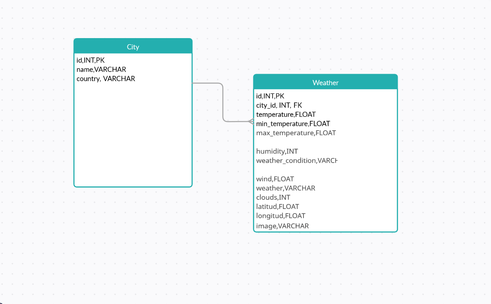
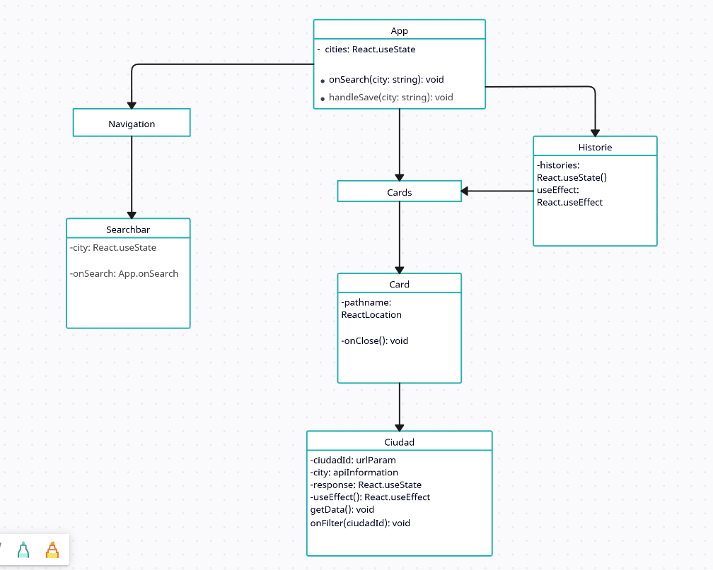

# Weather Application

## Descripción
Esta aplicación de clima permite a los usuarios buscar información meteorológica de distintas ciudades en tiempo real y visualizar el historial de búsquedas recientes. La aplicación está construida en React para el frontend y utiliza NestJS para la API backend. Los datos meteorológicos se obtienen a través de la API de OpenWeatherMap y se almacenan en una base de datos PostgreSQL.

## Tabla de Contenidos
- [Tecnologías](#tecnologías)
- [Estructura de la Aplicación](#estructura-de-la-aplicación)
- [Instalación](#instalación)
- [Configuración de Entorno](#configuración-de-entorno)
- [Ejecutar la Aplicación](#ejecutar-la-aplicación)
- [Componentes de React](#componentes-de-react)
- [API Endpoints](#api-endpoints)
- [Diagrama UML](#diagrama-uml)
- [Demostración](#demostración)

## Tecnologías
- **Frontend**: React
- **Backend**: NestJS
- **Base de datos**: PostgreSQL
- **API de Clima**: OpenWeatherMap

## Estructura de la Aplicación

```plaintext
root
│
├── back/                      # Directorio del backend en NestJS
│   ├── src/weather
│   │   ├── module             # Módulos de NestJS
│   │   ├── entities/          # Entidades (City y Weather)
│   │   ├── service            # Lógica de servicios
│   │   └── controller         # Controladores de API
│   └── ...
├── front/                  # Directorio del frontend en React
│   ├── src/
│   │   ├── components/        # Componentes de React
│   │   ├── App.js             # Componente principal con el router
│   │   ├── index.js           # Punto de entrada
│   └── ...
└── docker-compose.yml         # Configuración para contenedores Docker
```

## Instalación

1.- Clona el repositorio:

```bash
git clone https://github.com/SaulToscano/W-it-Weather-App.git
cd W-it-Weather-App
```

2.- **Configuración del Backend**: Ve al directorio `back` e instala las dependencias:

```bash
cd back
npm install || yarn install
```

3.- **Configuración del Frontend**: Ve al directorio `front` e instala las dependencias:

```bash
cd ../front
npm install || yarn install
```

## Configuración de Entorno

Crea un archivo `.env` en los directorios `back` y `front` con las siguientes variables de entorno:

**Back** (`back/.env`)

```plaintext
DATABASE_HOST=<IP del contenedor o host>
DATABASE_PORT=<Puerto>
DATABASE_USER=<Usuario de PostgreSQL>
DATABASE_PASSWORD=<Contraseña>
DATABASE_NAME=<Nombre de la base de datos>
OPENWEATHER_API_KEY=<Tu llave API de OpenWeatherMap>
```

**Frontend** (`front/.env`)

```plaintext
REACT_APP_API_URL=http://backend:5002/weather
```

Nota: Cambia `backend` por el nombre de tu contenedor o dominio si es diferente.

## Ejecutar la Aplicación

Para ejecutar ambos servicios, usa `docker-compose`:

```bash
docker-compose up --build
```

Esto levantará el backend en `http://localhost:5002` y el frontend en `http://localhost:3001`.

## Componentes de React

- **App**: Componente principal que contiene el enrutamiento y la barra de navegación.
- **Nav**: Barra de navegación que contiene el componente `Searchbar`.
- **Searchbar**: Permite a los usuarios buscar ciudades.
- **Historie**: Muestra las últimas ciudades buscadas.
- **Cards**: Muestra una lista de componentes `Card` con el resumen de cada ciudad.
- **Card**: Componente que muestra los detalles básicos del clima de cada ciudad.
- **Ciudad**: Vista detallada del clima de una ciudad específica.

## API Endpoints

El backend expone los siguientes endpoints:

- GET `/weather/:city` - Retorna la información meteorológica de la ciudad.
- GET `/weather/history/:id` - Retorna el historial de clima para una ciudad en base al id de la base de datos.
- GET `/weather/history/last` - Retorna las últimas 10 ciudades consultadas.
- POST `/weather/:city` Guarda la informacion meteorológica de la ciudad en la base de datos

## Diagrama UML

Este diagrama muestra la estructura de los componentes principales y sus interacciones en la aplicación.




## Demostración

Esta aplicacion tiene una demo levantada en `EC2` de `AWS` deployado con `docker-compose`

- **Backend**: https://wapi.stoscano.com/

- **Frontend**: https://weather.stoscano.com/
